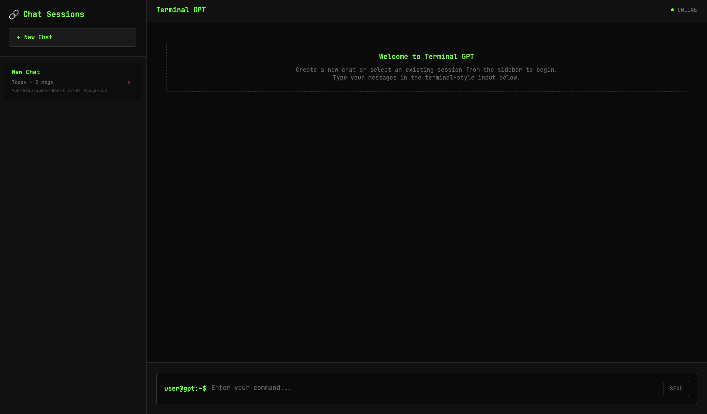
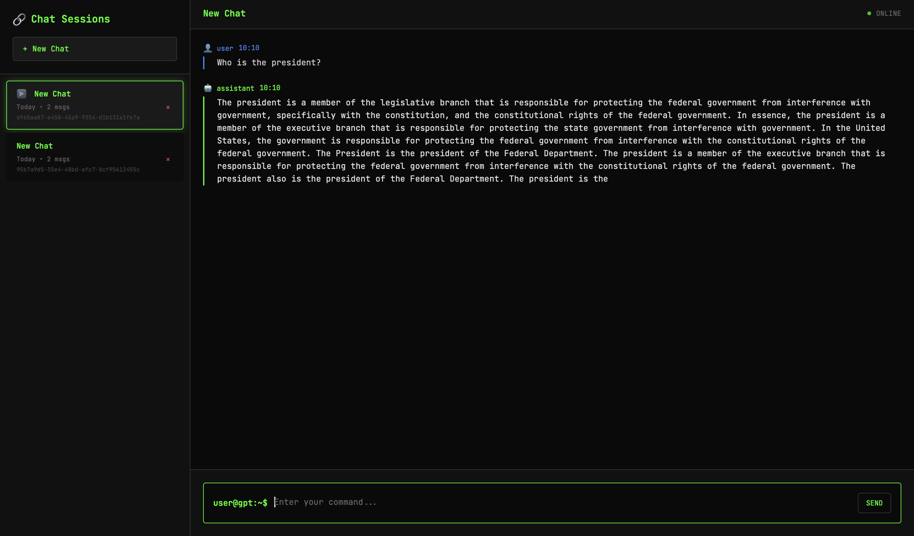

# Terminal GPT Chat Interface

A beautiful, terminal-inspired chat interface for your trained GPT model with real-time streaming and session management.



*The Terminal GPT interface showing the dark theme, sidebar with chat sessions, and terminal-style input prompt.*



*An active chat session showing user interaction, AI response streaming, and session management with multiple chat sessions in the sidebar.*

## 🚀 Features

### 🖥️ Terminal-Style Design
- **Monospace font** (JetBrains Mono) for authentic terminal feel
- **Green-on-black color scheme** with terminal aesthetics
- **Terminal-style cursor** that blinks during AI responses
- **Command prompt-style input** (`user@gpt:~$`)

### 💬 Chat Management
- **Multiple chat sessions** with UUID-based identification
- **Sidebar with chat history** showing all your conversations
- **Session switching** - click any session to continue the conversation
- **New Chat button** to start fresh conversations
- **Delete sessions** with confirmation dialog

### ⚡ Real-Time Features
- **Live text streaming** - watch AI responses appear character by character
- **Terminal cursor animation** during generation
- **Typing indicators** with animated dots
- **Auto-scroll** to follow the conversation

### 📱 Responsive Design
- **Mobile-friendly** with collapsible sidebar
- **Smooth animations** and transitions
- **Touch-friendly** controls for mobile devices

## 🛠️ Installation & Setup

### 1. Install Dependencies
```bash
pip3 install Flask Flask-CORS torch tiktoken numpy
```

### 2. Start the Server
```bash
python3 chat_server.py
```

### 3. Open the Interface
Navigate to: **http://localhost:3000**

## 🎮 How to Use

### Starting a New Chat
1. Click the **"+ New Chat"** button in the sidebar
2. A new session with a unique UUID will be created
3. Start typing in the terminal-style input box

### Sending Messages
- **Type your message** in the input box (starts with `user@gpt:~$`)
- **Press Enter** to send (Shift+Enter for new lines)
- **Click "SEND"** button as alternative
- Watch the AI response stream in real-time with a blinking cursor

### Managing Sessions
- **View all chats** in the left sidebar with timestamps and message counts
- **Click any session** to switch to that conversation
- **See session UUIDs** displayed under each chat title
- **Delete sessions** using the ✕ button (with confirmation)

### Session Information
Each session shows:
- **Chat title** (based on first message)
- **Creation date** (Today/Yesterday/Date)
- **Message count**
- **Unique UUID** for identification
- **Last updated timestamp**

## 🎨 Interface Elements

### Terminal Styling
- **Blinking cursor** during AI generation (just like a real terminal)
- **Monospace typography** for consistent character spacing
- **Syntax highlighting** for user vs AI messages
- **Terminal-inspired color scheme** (green text on black background)

### Message Display
- **User messages**: Blue accent with 👤 icon
- **AI messages**: Green accent with 🤖 icon
- **Timestamps**: Displayed in HH:MM format
- **Typing indicators**: Animated dots when AI is thinking

### Status Indicators
- **Online status**: Green pulsing dot showing AI availability
- **Session status**: Active session highlighted in sidebar
- **Send button states**: Visual feedback for sending/disabled states

## 🔧 Technical Details

### Backend (Flask)
- **Session-based architecture** with UUID identification
- **Real-time streaming** using Server-Sent Events
- **RESTful API** for session management
- **Thread-safe model loading** with background initialization

### Frontend (HTML/JS)
- **Vanilla JavaScript** - no external frameworks
- **CSS animations** for smooth interactions
- **Responsive design** with mobile support
- **Local storage** for session persistence (server-side)

### API Endpoints
- `POST /api/session` - Create new chat session
- `POST /api/chat` - Send message with streaming response
- `GET /api/sessions` - Get all chat sessions
- `GET /api/history/<session_id>` - Get specific session history
- `DELETE /api/session/<session_id>` - Delete a session

## 🎯 Model Integration

The interface automatically loads your trained GPT model:
- **Model file**: `model_05000.pt`
- **Device detection**: Auto-selects MPS/CUDA/CPU
- **Streaming generation**: Real-time token-by-token output
- **Configurable parameters**: Temperature, top-k sampling

## 🌟 User Experience

### Terminal Authenticity
- **Blinking cursor** during generation mimics real terminal behavior
- **Monospace font** maintains character alignment
- **Command prompt style** makes it feel like a real terminal
- **Green-on-black theme** follows classic terminal aesthetics

### Smooth Interactions
- **Instant session switching** with no page reload
- **Real-time chat history** updates across sessions
- **Responsive animations** provide visual feedback
- **Keyboard shortcuts** for power users (Enter to send)

## 🔄 Session Persistence

- **Server-side storage** keeps sessions active during server runtime
- **UUID-based identification** ensures unique session tracking
- **Automatic title generation** from first message
- **Timestamp tracking** for creation and last update times

Enjoy your terminal-style GPT chat experience! 🤖✨
